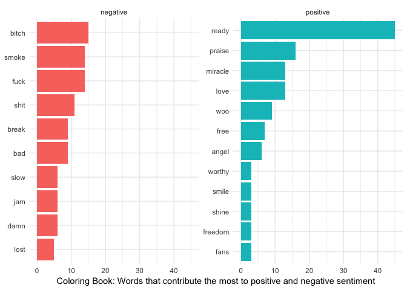

# geniusr 

[](https://www.tidyverse.org/lifecycle/#stable)
[](https://travis-ci.org/ewenme/geniusr)
[](https://ci.appveyor.com/project/ewenme/geniusr)
[](https://codecov.io/gh/ewenme/geniusr?branch=master)
[](https://cran.r-project.org/package=geniusr)
[](http://cran.rstudio.com/web/packages/geniusr/index.html)

## Overview

Tools for working with the Genius API.

  - Genius Developers Site: <https://genius.com/developers>
  - Genius API Docs: <https://docs.genius.com/>

## Install

Development version (recommended):

``` r
devtools::install_github("ewenme/geniusr")
```

Latest stable version on CRAN:

``` r
install.packages("geniusr")
```

## Authenticate

1.  [Create a Genius API client](https://genius.com/api-clients/new)
2.  Generate a client access token from your [API Clients
    page](https://genius.com/api-clients)
3.  Set your credentials in the System Environment variable
    `GENIUS_API_TOKEN` by calling the `genius_token()` function and
    entering your Genius Client Access Token when
prompted.

## Use

### How many times did Kanye West say “good morning”, on the track “Good Morning”?

``` r

library(geniusr)
library(dplyr)
library(tidytext)

# get lyrics
get_lyrics_search(artist_name = "Kanye West",
                  song_title = "Good Morning") %>% 
  # get lyric bigrams
  unnest_tokens(bigram, line, token = "ngrams", n = 2) %>%
  # count bigram frequency
  count(bigram) %>%
  # look for good morning
  filter(bigram == "good morning")
#> # A tibble: 1 x 2
#>   bigram           n
#>   <chr>        <int>
#> 1 good morning    18
```

### Positive / Negative Sentiment in Coloring Book, by Chance the Rapper

``` r

library(purrr)
library(ggplot2)

# set lexicon
bing <- get_sentiments("bing")

# scrape album tracklist
tracklist <- get_album_tracklist_search(artist_name = "Chance the Rapper",
                                        album_name = "Coloring Book")

# scrape album lyrics
lyrics <- map_df(tracklist$song_lyrics_url, get_lyrics_url)

# counting negative / positive words
sentiment <- lyrics %>%
  unnest_tokens(word, line) %>%
  # remove stop words
  anti_join(stop_words) %>%
  # join afinn score
  inner_join(bing) %>%
  # count negative / positive words
  count(word, sentiment, sort = TRUE) %>%
  ungroup()

# plotting top contributors
sentiment %>%
  group_by(sentiment) %>%
  top_n(10) %>%
  ungroup() %>%
  mutate(word = reorder(word, n)) %>%
  ggplot(aes(word, n, fill = sentiment)) +
  geom_col(show.legend = FALSE) +
  facet_wrap(~sentiment, scales = "free_y") +
  labs(y = "Coloring Book: Words that contribute the most to positive and negative sentiment",
       x = NULL) +
  coord_flip() +
  theme_minimal()
```

<!-- -->

## Other options

  - the [genius](https://github.com/JosiahParry/genius) package
    specialises in lyrics retrieval from Genius.
